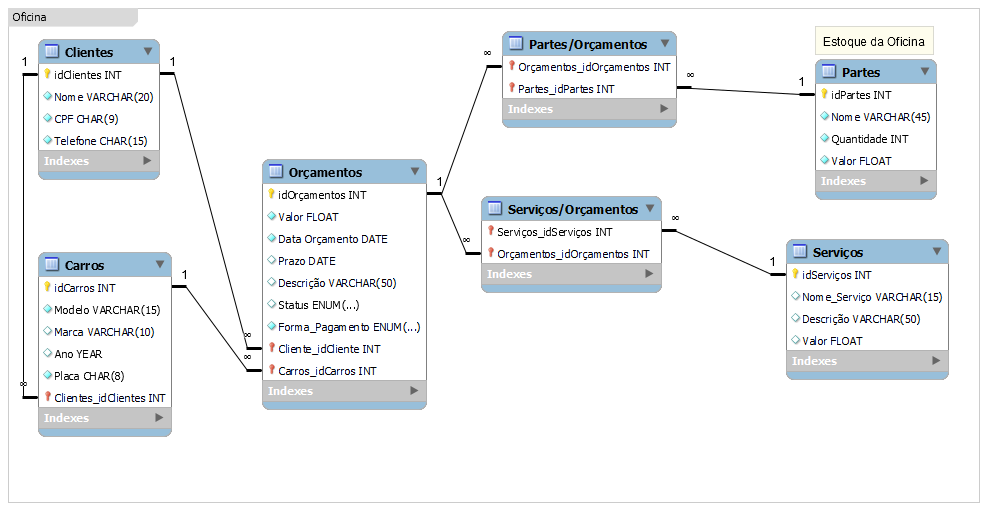

# Desafio SQL - Database Oficina

Banco de dados feito utilizando o MySQL sobre um sistema de Oficina. Dentro deste repositório estão o Diagrama que utilizei para pensar no desenvolvimento do banco de dados, assim como os Scripts de criação das tabelas e os de inserção de dados e também as queries SQL.

## Entidades do Sistema
- Fornecedor
- Terceiro - Vendedor PF e PJ
- Produto
- Cliente PF e PJ
- Fornecedor

## Modelo lógico

## Modelo fisico

Perguntas utlizadas para realização das queries SQL:
- Qual é o valor total de todos os orçamentos registrados?
- Quais são os modelos de carros presentes na tabela "carros"?
- Quais são os nomes dos clientes presentes na tabela "clientes"?
- Quais são os nomes dos serviços presentes na tabela "servicos"?
- Quais são os orçamentos com valores acima de R$ 2.000?
- Quais são os carros com o ano de fabricação superior a 2018?
- Quais são os clientes que possuem "Honda" como marca de carro?
- Crie uma coluna no resultado da consulta que mostre a diferença em dias entre a "data_prazo" e a "data_orcamento" na tabela "orcamento".
- Liste os orçamentos em ordem decrescente de valor.
- Ordene os carros por marca e, dentro de cada marca, por modelo em ordem alfabética.
- Quais são os clientes que têm mais de um carro cadastrado na tabela "carros"?
- Liste os orçamentos, mostrando o nome do cliente e o modelo do carro para cada um.
